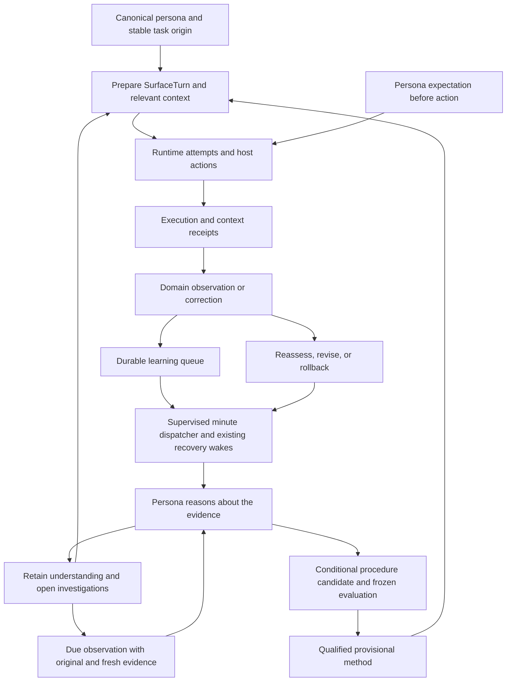

# Extend Persona Harness Learning

Harness introduced in v1.8.0; continuous cognition introduced in v1.9.0.
This guide covers framework integration; see the
[operator guide](persona-harness-learning.md) for inspection, pause, and rollback.

## Lifecycle And Ownership

### Unified Synthesis And Tuning Interfaces

`personas.learning.synthesis.request_synthesis(service, kind, *, source_key,
now=None, force=False, test_mode=False)` admits `reflection` or `dream` to the
existing queue. The shared service remains the identity and eligibility owner.
`synthesis_status(service)` reads persisted progress without collecting sources.
`synthesis_sources.collect_sources(service, kind, *, now=None)` is a host-owned
collector; callers must not replace it with model-generated evidence.

The collector contract is `{ref, revision, kind, text, evidence_ids, source_time,
start, end, complete, metadata}`. `ref` and `revision` identify a physical source
version; `[start, end)` identifies the supplied character range. The frozen
`synthesis_cycle.input_manifest` is exact; `omitted_manifest` retains excluded
ranges without pretending the model saw them. Root observations stay in
`evidence_ids`; generated understanding and investigation inputs stay in
`derived_input_ids`. Changed windows must not mint new independent evidence for
the same underlying source. Unknown historical evidence counts remain unknown.

Queue checkpoints are `synthesis_reason`, `synthesis_retain`, `synthesis_support`,
and `synthesis_project`. A `synthesis_reasoning` event preserves completed inference
and execution identity; `synthesis_consumed` records exact successfully retained
inputs; `synthesis_projected` proves the legacy artifact callback completed.
Retry retention/projection against the saved inference. Never mark an entire
scanned episode consumed because only its bounded excerpt reached the model.

Journal projection v2 excludes operational-only status/timestamp churn from
consolidation input identity. Its revision hashes the exact projected text.
Migration bridges fully reconstructed, successfully consumed v1 inputs;
incomplete historical excerpts never claim coverage of an unseen v2 suffix.
Reflection admission checks the independent roots behind cognitive restatements.
Dream admission still includes changed derived understanding. Investigation
coalescing applies only to identical active questions, evidence, and triggers.

`persona-cognition-v2` supplies an explicit list of citable journal IDs from the
executed source manifest. Rejected outputs receive execution and context receipts
with `output_status: invalid_contract`, plus a bounded diagnostic event; raw
invalid output is not retained. Retries include that diagnostic and recompute the
current citable set. Successful saved reasoning is reused after interruption.

`investigation_sources` is a framework-owned observer for already captured source
revisions. It reuses original observations and checks persona ownership, physical
source bindings, revision changes, timestamps, and immutable consumption history.
Host activity metadata selects installed acquisition adapters; model-written
domain labels cannot supply module names, URLs to fetch, or access permissions.
An installed collector with no new result may use a matching journal revision.
Unanchored historical questions stay blocked until a valid observed anchor exists.
Automatic behavior proposals use the shared change authority and existing
physical promotion/rollback owners. Retained ideas cannot authorize an amendment.

`evolve.tuning.tune(service, now=None)` is asynchronous queue admission;
`tuning_status(service)` and `rollback_policy(service, reason=...)` are synchronous.
Validated inputs are admitted through `import_validated_cases(service, cases,
source_key=...)`. Tuning uses distinct `tuning_case`, `tuning_corpus`, `tuning_run`,
`tuning_evaluation`, and `tuning_policy` records. Do not store retrieval evaluations
as method qualifications or change generic config during a concurrent recall.
Policy activation is a `tuning_activation` event on its policy record, not a
method activation or a separate record kind.
Policy application remains scoped to the request's persona and honors explicit
operator overrides.

Import prepared labels with `thehomie evolve tune --persona <id> --cases
<cases.json> --source-key <stable-import-id> --json`. The JSON is an array; each
case follows the host-validated contract below. Paths are relative to that
persona's vault; SHA-256 hashes and excerpts must match physical source bytes.
The current ranking is never a source of ground-truth labels.

| Case field | Contract |
|---|---|
| `case_key`, `query`, `source_family` | Stable case identity, recall request, and grouping for leakage prevention |
| `source` | `{path, sha256, excerpt}` for the originating evidence |
| `labels` | Array of `{evidence: {path, sha256, excerpt}, relevance, rationale}`; relevance is 0 through 3 |
| `validation` | `{method: "operator", actor, at, independent_of_retrieval_scores: true}`; `at` is an ISO timestamp with timezone |
| `request_budget` | `{max_results, context_chars, search_mode}`; 1–20 results, 100–100000 characters, mode `auto`, `hybrid`, or `keyword` |
| `protected`, `forbidden_paths` | Protected-case flag and vault-relative exclusion paths |

Source-family SHA-256 modulo four fixes the held-out assignment. Readiness
requires at least 60 validated cases, including 30 development and 12 held-out
cases. A validated-case count alone is insufficient when source families cannot
produce a valid split. Corpus/run/evaluation/policy links preserve the frozen
case set, candidate choice, paired confidence bound, latency, and rollback chain.

Operator contracts are additive: summary includes `lifecycle` and `tuning`;
GET `/learning/lifecycle` and `/learning/tuning` inspect them. Explicit POST
`/learning/tuning/run` admits work; POST `/learning/tuning/rollback` delegates to
the policy owner. All paths keep dashboard authentication, physical profile
checks, persona scope, error status, and secret/path redaction. Hono translates
only through its canonical persona mapper and never opens the learning database.
The UI never infers actual model usage from a completed cycle: `context_only`
reorientation and concrete execution receipts are shown separately.

The new contracts require isolated source/retry, provenance, authority,
tuning-adoption/rollback, API, and UI verification. A passing suite establishes
local behavior; live provider, deployment, and release proof are separate.

The Python harness owns persistent learning. A surface captures what crossed its
host boundary; a domain producer supplies evidence of what happened afterward.
Provider-specific hooks may adapt these boundaries, but must not own a separate
learning ledger or qualification policy.



## Continuous Cognition Contract

The same profile-local journal stores `cognitive_cycle`, `understanding`, and
`investigation` alongside the original experience/method records. The service
owns transitions. Runtime and domain adapters provide actual observations and
invoke the service; they do not create a second ledger or a provider-specific
learning policy.

- `enqueue_cognitive_cycle(phase, origin_key, evidence_ids, *, experience_id,
  investigation_id, metadata)` accepts `reorient`, `interpret`, `reflect`, or
  `revisit`. Its stable event identity coalesces duplicate hooks. Evidence must
  belong to real work; generated reflection, evaluation, and practice cannot
  recursively initiate another cycle.
- `record_understanding(payload, *, source_key)` retains a tentative concept,
  interpretation, belief, self-assessment, or source assessment. Supply title,
  content, scope, uncertainty, and owned evidence IDs. A revision references its
  predecessor. Support evaluation can later establish supported knowledge;
  retained understanding does not automatically authorize a working procedure.
- `open_investigation(payload, *, source_key)` persists question, why, domain,
  evidence, and a validated trigger. `transition_investigation()` appends progress,
  new evidence, next-check time, or a conclusion. A closed inquiry requires a
  new inquiry rather than silently reopening history.
- `render_cognitive_context(task, ...)` selects relevant understanding and open
  investigations within the existing prompt budget. Context receipts include
  `record_kind`, `record_id`, and `content_hash` for these versions; methods retain
  their candidate/activation references. Only actual executed inclusion is
  evidence that the version reached a completed request.

Completed reasoning is persisted before retention/support checkpoints so a
retry can reuse the actual result. A cycle can remain retained while support
verification is unavailable. Persist the concise conclusion, uncertainty,
evidence references, and resulting IDs, not raw private monologue. Failed
procedure qualification leaves retained observations and questions intact.

### Bind A Domain Observation

`cognition.register_investigation_observer(domain, observer)` registers a
host-owned collector receiving the explicit service and investigation. Collect
fresh evidence against the original trigger, preserving source IDs, revision,
cutoff, and quality. Return unavailable evidence explicitly; do not substitute
a generated answer or relax a trading/action gate to manufacture experience.

Trigger contracts are validated by `validate_investigation_trigger()`:

| Type | Required observation request |
|---|---|
| `deadline` | Timezone-aware `at` |
| `closed_candles` | `asset`, `venue`, `timeframe`, timezone-aware `after`, integer `count` |
| `crossing` | `asset`, `venue`, `timeframe`, `metric`, finite `baseline`/`threshold`, `direction` above or below |
| `source_update` | `source_id`, original `revision`, optional `thread_id` |

A chart image, computed indicators, and candle cutoff must describe one frozen
source set. A vision receipt must establish actual image inclusion; otherwise
label the request numeric-only. Preserve investigation-linked chart evidence
past display cleanup. Source edits create revisions and retain the original
claim. Claims about author reliability need observed claims and sample size.

### Isolated Lifecycle Example

This example verifies durable retention and later context linkage using an
explicit temporary target. It does not run background inference, contact a
provider, or claim that the example interpretation is correct.

```python
from pathlib import Path
from tempfile import TemporaryDirectory
from unittest.mock import patch

from personas.learning.models import LearningTarget
from personas.learning.service import LearningService

with TemporaryDirectory(dir=".") as directory, patch.dict("os.environ", {
    "PERSONA_LEARNING_ENABLED": "true", "HOMIE_KILLSWITCH_HARNESS_LEARNING": "enabled",
}):
    root = Path(directory).resolve()
    service = LearningService(LearningTarget(
        "example", root / "memory", root / "data", root / "state", root / "skills",
    ))
    experience = service.capture_experience("chart-1", "example", "Review breakout follow-through")
    observed = service.record_observation(experience["id"], {
        "evidence": "The closed candle returned below the previously observed level.",
        "quality": "direct", "status": "resolved",
    }, source_key="candle-revision-1")
    cycle = service.enqueue_cognitive_cycle("interpret", "chart-1:closed", [observed["id"]],
                                            experience_id=experience["id"])
    idea = service.record_understanding({
        "understanding_type": "interpretation", "title": "Breakout follow-through",
        "content": "This breakout did not hold on the next observed close.",
        "scope": "breakout follow-through", "uncertainty": "One example, not a general rule",
        "evidence_ids": [observed["id"]], "cycle_id": cycle["id"],
    }, source_key="example-interpretation")
    inquiry = service.open_investigation({
        "question": "Does the following close reclaim the breakout level?",
        "why": "Distinguish temporary rejection from a sustained reversal.",
        "domain": "example", "evidence_ids": [observed["id"]], "cycle_id": cycle["id"],
        "trigger": {"type": "deadline", "at": "2030-01-01T01:00:00Z"},
    }, source_key="example-follow-up")
    reopened = LearningService(service.target)
    assert reopened.get_record(inquiry["id"])["status"] == "open"
    context = reopened.render_cognitive_context("Review breakout follow-through", max_chars=4000)
    assert any(version["record_id"] == idea["id"] for version in context.versions)
    assert not reopened.store.all("activation")
```

Production code supplies actual source evidence and lets the cognitive worker
invoke reasoning and retain its validated result. The explicit interpretation
above isolates the persistence boundary for a runnable example.

## Hooks, Dispatch, And Reporting

`runtime/function_hooks.py` is the provider-neutral function-hook owner. Its
`FunctionHookEvent`, `register_hook`, `emit`, and `emit_cognitive_event` interfaces
carry common events: `work.start`, `evidence.received`, `work.completed`,
`work.failed`, `session.closed`, and `investigation.due`. Handlers enqueue actual
persona reasoning through the cognitive worker; they do not replace thinking
with scripted conclusions. Claude, Codex, Kimi, and other runtime adapters use
the same state and lifecycle.

| Framework event | Cognitive phase | Host boundary |
|---|---|---|
| `work.start` | `reorient` | Start/resume with canonical persona and activity identity |
| `evidence.received` | `interpret` | Meaningful batch of observed source/tool evidence |
| `work.completed`, `work.failed` | `reflect` | Durable debrief for the completed or interrupted work |
| `session.closed` | `reflect` | Debrief persisted before transient session context is cleared |
| `investigation.due` | `revisit` | Validated trigger and a fresh evidence revision |

Hook registration is trusted, in-process Python middleware:
`register_hook(name, callback, key=...)`, where the callback receives
`(event, next_handler)` and returns the durable receipt. Instrumentation that
observes the existing lifecycle should call `next_handler()` and return its
result. Registration itself is not a durable scheduler or an inference call;
the learning journal and worker own those responsibilities. Never derive persona
identity, executable paths, or callback code from untrusted model/source text.

`runtime/claude_function_hooks.py` is only the Claude transport adapter. Claude
Mods events enter the common framework hooks through that adapter; Claude is
not required for cognition or background reasoning. Feature-probe the binary that
will actually execute a request before selecting Claude Mods or SDK/engine
callbacks. The global CLI and the SDK-bundled CLI can support different APIs.
Bind persona/activity identity in the host, forward only supported events, and
expose the selected adapter and observed coverage. Function hooks enqueue work
or supply context; long model reasoning stays in the shared worker.

Generic HTTP model-only adapters disable tools explicitly and support image
inclusion receipts. `SECOND_BRAIN_GENERIC_MAX_OUTPUT_TOKENS` is an optional
positive installation ceiling. With no ceiling, output defaults to 4096 tokens;
a host `max_output_tokens` request can change that default but cannot exceed an
explicit installation ceiling. These adapters do not invent pricing to enforce
USD budgets: a non-null dollar budget requires a budget-aware configured runtime,
and an unsupported request remains a visible routing refusal or fallback.

The supervised 60-second dispatcher is an installation-wide leader with
foreground priority and fair persona selection. Existing scheduled jobs are
recovery wakes for the same durable queue. Typed pause, contention, lease,
timeout, and provider failures defer work without converting them into failed
learning. The worker checkpoint remains the restart boundary.

### Durable Session Debriefs And Physical Message Identity

The session-end hook first publishes an immutable, redacted replay envelope in
the persona's `state/learning-lifecycle-outbox/`, before it accesses the learning
SQLite stores. Version 3 preserves the full accepted canonical transcript and
its identity hash; it no longer silently trims a long session to the old 16000
character prefix. The envelope limit is 8000000 characters. Oversized or invalid
input fails validation rather than being acknowledged as fully retained.

Normal learner discovery replays pending envelopes after a restart or temporary
database failure. Long transcripts become contiguous observations of at most
3500 characters with `[start, end)`, transcript hash, and total source length.
Reflection cycles receive at most four excerpts per batch. All excerpts and
their cycle references become durable before the outbox entry is acknowledged.
The saved binding receipt includes `observation_ids`, `cognitive_cycle_ids`,
`source_chars`, and `source_fully_retained`. This means source retention and
queue admission, not completed inference or an observed domain outcome. Stable
source keys coalesce replay after a partial failure. Older v1/v2 envelopes remain
readable; an older truncated source does not gain an invented missing tail.

Both SQLite and PostgreSQL session stores preserve nullable
`chat_messages.source_origin_ref` alongside each physical message ID. New engine
writes bind the original host turn and role as `chat-message:<origin>:<role>`;
approval resumes keep the same origin. `ChatMessage.source_ref` returns that
persisted origin when available and otherwise falls back to
`chat-message:<session_id>:<physical_message_id>` for older rows. A missing
physical identity remains unknown. `source_revision` hashes the literal role
and content, independently of collection windows or read time. Transcript export
and excerpt provenance carry these same references and revisions, so repeated
windows cannot manufacture independent observations of the same message.

### Queue Progress And Reports

Queue policy distinguishes due reassessment, current cognition, and historical
recovery. Within a priority class, `available_at` orders ready jobs before
creation time: an old unavailable provider request cannot retake every wake and
starve newer runnable work. Rediscovery refreshes policy on queued/deferred/retry
jobs without changing their identities, checkpoints, failure counts, or claims.
Completed reasoning is reused across retries; provider outages do not consume
the candidate's semantic-failure allowance.

`reporting.build_learning_report(service, *, since, until)` returns host-computed
counts and inspectable records without writes or model calls. It distinguishes
understanding revisions from distinct conclusion content, procedure qualification
summaries from raw trial/manifests, and executed cognitive-context inclusion.
Periods use aware timestamps, inclusive start/exclusive end, at most 366 days.
Current status projections accompany the dated records; they are not a historical
database snapshot. The operator projection redacts secrets and local paths.

Tool-capable persona turns expose the read-only, host-scoped `learning_report`
tool alongside `record_expectation`. A caller cannot choose another persona;
the canonical dispatcher supplies identity. Tool execution returns valid bounded
JSON with complete host counts and explicitly truncated record summaries. It
never invokes another model, sends a notification, or creates a learning record.

`reporting.requested_report(task)` recognizes direct short questions such as
“What did you learn this week?” and returns the requested date bounds. Calendar
phrases use the deployment timezone; unqualified questions use the last seven
days. Quoted examples, implementation requests, source JSON, and meta-discussion
do not match. Central hooks may inject `report_context(report)` for such a
request without granting tools to a model-only runtime. Counts are always the
host's full-period totals, not the number of source excerpts shown to the model.

`GET /api/agents/{persona_id}/learning/report` inspects that report. An explicit
`POST` at the same path invokes `explain_learning_report()` and persists a bounded
model receipt in the existing store settings. Both accept `since` and `until`
query parameters. Hono only forwards allowed parameters and uses the existing
main/default mapper. CLI `report --explain` reaches the same Python boundary.

`await reporting.dispatch_learning_reports(services, *, now=None)` queues one
combined daily explanation after 18:00 and important persisted changes through
the existing default-profile proactive-action queue. The dispatcher supplies
enabled services including default; it does not switch ambient persona variables.
At most one bounded report model call runs in a tick. Queue and report receipts
deduplicate after delivery and restart. Actual delivery remains the heartbeat's
existing policy-controlled drain; a queued report is not a sent notification.

## Deployment Identity And Evaluator Compatibility

`HOMIE_DEFAULT_PROFILE_ROOT` identifies the deployed default installation; an
absent override preserves legacy resolution. Bot, worker, scheduled, CLI, and API
processes must agree on that root. `HOMIE_HOME` identifies the active persona;
`ORCHESTRATION_DB_PATH` separately selects existing orchestration storage.
Before first path resolution, boot and config read only the default-root, vault,
orchestration, and shared-activity pins from the executing checkout's local
`.claude/scripts/.env`; explicit process values win, and reload preserves the
bound pins. Use literal paths (an absolute default installation root), not dotenv
interpolation. Named learner children retain an explicit profile `.env`
orchestration pin instead of inheriting the main bot's domain database; default
root and activity storage remain shared.

Inventory and back up split stores before reconciliation, preserve disjoint or
identical records, and refuse conflicting IDs. A new checkout must not silently
create a second learning history for the same main Homie.

Evaluator version 3 freezes criterion IDs, definitions, applicability, and
hard/advisory classification before trials. Free-form criticism is advisory;
only substantiated violations of applicable predeclared hard criteria can veto
adoption. Preserve old evaluations and requalify affected candidates with fresh
held-out cases. Source-supported understanding and procedure qualification remain
separate counts and contracts.

## Connect a runtime surface

Use `get_learning_service(persona_id)` or `LearningService.for_persona(persona_id)`
in production. They resolve the explicit physical profile through the canonical
persona helpers. Python uses `default`; the existing dashboard boundary translates
`main`. Do not construct production paths from an ambient profile, caller-supplied
filesystem path, or a record ID. Explicit `LearningTarget` objects below isolate
examples from installed profiles.

After assembling and clamping the existing prompt, call `prepare_turn_async()`
(`prepare_turn()` for synchronous hosts). It returns a `SurfaceTurn` containing
the request to execute. Pass **`turn.request`** through
`runtime.lane_router.run_with_runtime_lanes()`, then use
`await turn.acomplete(result)` before publishing its returned text. On exceptions,
including cancellation, call `await turn.afailed(exc)` and re-raise. Synchronous
completion and failure methods are `complete()` and `failed()`.

- Keep `origin_id` stable across delivery retries, approval resumes, and provider
  fallback. Chat adapters use `incoming_origin(incoming, session_key)` and
  `canonical_turn_id()`; text or a fresh retry UUID is not a logical task ID.
- Each runtime attempt gets its own ID and actual provider/model metadata from
  the canonical runtime's `attempt_observer`. Preserve this callback. A host retry
  can use `aretry_request()` while retaining the experience; fallback remains the
  runtime's responsibility.
- Tool-capable surfaces keep the scoped registry definitions and dispatch.
  Preparation wraps host dispatch without granting tools. The persona calls the
  registered `record_expectation` before a meaningful write or execution. Read
  tools do not consume that expectation. Existing action approval still applies.
- A tool-less recommendation can append the expectation envelope shown below.
  The host records it before publication, not before drafting. Ordinary
  conversation does not need an invented prediction.
- Host dispatch and final output are observable. Provider-owned internal shell,
  browser, or reasoning steps without host callbacks remain explicitly uncaptured.
  `require_capture=True` makes capture failures fatal for a controlled experiment;
  ordinary surfaces expose coverage failures and continue.
- `complete()` records a generated artifact with `publication_confirmed=False`.
  A downstream publisher must provide its own verified execution or observation
  receipt; generated text does not establish delivery or a domain outcome.

The trailing envelope is `<<LEARNING_EXPECTATION: {"claim":"Testable prediction",
"check_by":"2030-01-01T00:00:00+00:00","resolution_rule":"Observable resolution rule",
"situation":{"context":"Point-in-time situation"}}>>`. Set `check_by` to the
actual future, timezone-aware observation deadline; the date above is illustrative.
The four fields are required. `SurfaceTurn.complete()` strips this marker from
published text and supplies `phase="pre_publication"` and `author="persona"`.

Context receipts use three phases: `prepared`, `submitted`, and `executed`.
Only an executed receipt containing a selected method has status `delivered`.
Receipts compare the exact outgoing prompt with selected content; merely selecting
a method, preparing a request, or starting a failed attempt cannot prove its use.
The normal runtime callback records submission, and completion records execution
with `RuntimeResult.model` and `.provider`. Hosts that need an earlier prepared
receipt can call `record_context_receipt(..., phase="prepared")` explicitly.

Foreground reorientation selects retained context once before the cognitive
pass, then passes that same bundle into turn preparation. Its `cognitive_cycle`
stores `input_versions`, `context_hash`, and `context_delivery`. A context-only
assembly is `execution_kind="context_only"`, `context_delivery="prepared"`, with
zero model calls. Actual foreground reasoning requires a successful runtime
receipt with concrete model/provider and an output hash. Even that reasoning
receipt marks the selected bundle `executed` only when its
`retained_context_hash` matches the exact selected context hash. Otherwise the
bundle remains `prepared`. Final-response context delivery is recorded separately
by the ordinary submitted/executed runtime receipts. Neither preparation nor a
completed cycle alone establishes that a model received a retained version.

### Runnable surface smoke

Run each Python block as a complete script from `.claude/scripts` using the
repository's Python environment. The examples create and remove a temporary
directory beneath that working directory. Their temporary learning flags override
only the example process. No installed profile, worker, account, or model is used.

This fake runtime emits the same attempt events as the real router. It verifies
the integration shape, not provider behavior or improved performance. With no
qualified methods in the temporary profile, context receipts correctly stay empty.

```python
import asyncio
from pathlib import Path
from tempfile import TemporaryDirectory
from unittest.mock import patch

from personas.learning.hooks import prepare_turn_async
from personas.learning.models import LearningTarget
from personas.learning.service import LearningService
from runtime.base import RuntimeRequest, RuntimeResult


async def fake_runtime(request):
    event = {
        "attempt_id": "fake-attempt-1", "runtime_lane": "generic_runtime",
        "provider": "fixture", "model": "fixture-v1",
    }
    await request.attempt_observer({**event, "phase": "started"})
    result = RuntimeResult(
        text="Ask which deliverable matters most.",
        runtime_lane="generic_runtime", provider="fixture", model="fixture-v1",
    )
    await request.attempt_observer({**event, "phase": "succeeded"})
    return result


async def main():
    flags = {
        "PERSONA_LEARNING_ENABLED": "true",
        "HOMIE_KILLSWITCH_HARNESS_LEARNING": "enabled",
    }
    with TemporaryDirectory(prefix="learning-doc-", dir=".") as directory:
        root = Path(directory).absolute()
        service = LearningService(LearningTarget(
            persona_id="docs-demo", memory_dir=root / "memory",
            data_dir=root / "data", state_dir=root / "state",
            skills_dir=root / "skills",
        ))
        with patch.dict("os.environ", flags):
            turn = await prepare_turn_async(
                RuntimeRequest(
                    prompt="A prospect questions price. Suggest a diagnostic question.",
                    cwd=root, task_name="documentation-smoke", model="fixture-v1",
                    model_only=True, allowed_tools=[], disallowed_tools=["*"],
                ),
                persona_id="docs-demo", surface="documentation",
                origin_id="fixture:conversation-1:turn-1", service=service,
                require_capture=True,
            )
            service.record_context_receipt(
                turn.experience["id"], turn.context, turn.request.prompt,
                attempt_key="fake-prepared", phase="prepared",
            )
            try:
                result = await fake_runtime(turn.request)
                text = await turn.acomplete(result)
            except BaseException as exc:
                await turn.afailed(exc)
                raise
            contexts = service.list_records("context")["items"]
            assert {r["phase"] for r in contexts} == {
                "prepared", "submitted", "executed",
            }
            assert all(r["status"] == "empty" for r in contexts)
            executed = next(r for r in contexts if r["phase"] == "executed")
            assert (executed["provider"], executed["model"]) == ("fixture", "fixture-v1")
            assert not turn.failures
            assert text == result.text
            print("Surface capture and context phases verified; no methods activated.")


asyncio.run(main())
```

For production, replace the temporary target with the canonical resolver and the
fake call with `run_with_runtime_lanes(turn.request)`. Retain the surface's existing
runtime selection, scoped tools, authorization, and publication handling.

## Connect a domain evidence producer

A producer calls `capture_experience()`, commits the persona's expectation before
the action, records execution, and later calls `record_observation()` with the
same experience/expectation IDs. Use immutable source IDs plus revision IDs for
idempotency. Replaying identical content under the same key returns the same
record; changing content requires a new key. Credentials never belong in evidence.

Use `mode="backfill"` and `phase="retrospective"` for historical material. Study
sources must distinguish literal source evidence from model-generated synthesis.
Practice/evaluation output must not masquerade as real outcomes. Preserve the
source's timestamp, identity, captured bytes or verifiable receipt, and uncertainty.
An execution's success alone does not establish that its expectation held.

The next example simulates a local diagnostic action and a corrected result. It
uses real persistence APIs, without inventing an evaluator receipt or activating
a method. Both observations are synthetic fixtures confined to temporary storage.

```python
from datetime import UTC, datetime, timedelta
from pathlib import Path
from tempfile import TemporaryDirectory
from unittest.mock import patch

from personas.learning.models import LearningTarget
from personas.learning.service import LearningService

flags = {
    "PERSONA_LEARNING_ENABLED": "true",
    "HOMIE_KILLSWITCH_HARNESS_LEARNING": "enabled",
}
with TemporaryDirectory(prefix="learning-doc-", dir=".") as directory:
    root = Path(directory).absolute()
    service = LearningService(LearningTarget(
        persona_id="docs-demo", memory_dir=root / "memory",
        data_dir=root / "data", state_dir=root / "state", skills_dir=root / "skills",
    ))
    with patch.dict("os.environ", flags):
        experience = service.capture_experience(
            "fixture:job-42", "local-diagnostic", "Check an example document",
            mode="practice", metadata={"synthetic": True},
        )
        expectation = service.commit_expectation(experience["id"], {
            "claim": "The example document contains no broken links.",
            "check_by": (datetime.now(UTC) + timedelta(hours=1)).isoformat(),
            "resolution_rule": "The complete scanner receipt reports zero broken links.",
            "situation": {"document_revision": "fixture-revision-1"},
            "phase": "pre_action", "author": "persona",
        }, action_key="scan-1")
        service.record_execution(experience["id"], {
            "action_key": "scan-1", "expectation_id": expectation["id"],
            "success": True, "artifact": {"scanner_run_id": "fixture-run-1"},
        }, attempt_key="scan-1:attempt-1")
        first = service.record_observation(experience["id"], {
            "expectation_id": expectation["id"], "status": "resolved",
            "quality": "direct", "held": True,
            "evidence": {"source_id": "fixture-run-1", "broken_links": 0},
        }, source_key="fixture-run-1:receipt-v1")
        correction = {
            "expectation_id": expectation["id"], "status": "resolved",
            "quality": "direct", "held": False, "supersedes": first["id"],
            "evidence": {
                "source_id": "fixture-run-1", "broken_links": 2,
                "reason": "The first receipt omitted a scanned page.",
            },
        }
        corrected = service.record_observation(
            experience["id"], correction, source_key="fixture-run-1:receipt-v2",
        )
        replay = service.record_observation(
            experience["id"], correction, source_key="fixture-run-1:receipt-v2",
        )
        assert replay["id"] == corrected["id"]
        assert service.get_record(first["id"])["status"] == "superseded"
        assert len(service.list_records("observation")["items"]) == 2
        assert not service.list_records("activation")["items"]
        print("Expectation, execution, correction, and idempotent replay verified.")
```

For delayed polling, extend the existing `collect_due_observation()` dispatch in
`personas/learning/observers.py` and the domain integration that owns its source.
There is no observer plugin registry to register with. The current dispatcher
understands linked Sales mail outcomes; unknown domains return an explicit
`unresolvable` receipt. Add the new domain branch and tests together, using
`expectation.situation` for stable linkage and read-only collection when possible.
Normalize to `quality`, `status`, `evidence`, and `expectation_id`; use `open` for
pending results, `partial` for incomplete access, and `unresolvable` when the claim
cannot be resolved. Missing evidence must not become `held=False`.

Use `supersedes` only to correct an earlier observation. A reply that arrives
after a truthful no-reply-through-deadline observation is new evidence; preserve
the earlier window. The worker fingerprints polling results to avoid rediscovery.

## Scheduling, qualification, and verification

Persistence notifications enqueue work without calling models or launching a
process. `personas.learning.worker.wake_learning()` drains the current or explicit
profile; `personas.learning.worker.run_pending_profiles()` starts correctly
bootstrapped profile children, including default, from the default profile. Existing heartbeat,
reflection, and dream paths use these seams. Extend them; do not add a parallel
cron or inline evaluator to a foreground turn.
The worker checkpoints stages, shares an install-wide lease, and yields to
foreground activity. Provider infrastructure failures defer work; semantic
failures retain bounded retries. Keep these states visible in operator history.

For a specific operator check, run `persona_learning_worker.py -p <persona>
--job-id <existing-job-id> --max-stages 8`. This advances only that existing
eligible job through the same worker, leases, stage checks, and evaluation.
It does not admit new work, change priority, or bypass backoff, pause, or
foreground controls. Ordinary wakes retain their normal queue ordering.

Current understanding leads imported historical material in synthesis selection;
unconsumed older ranges remain eligible. Cognitive source extraction adapts to
the existing input budget and records exact JSON-pointer omissions. Declared
concise synthesis fields are validated before retention; unrequested model
commentary is discarded rather than stored as private deliberation or allowed
to block an otherwise valid result.

The worker proposes conditional candidates and freezes actual before/after
context bundles, evidence revisions, and separate qualification cases.
`evaluation.evaluate_candidate()` owns evaluation receipts;
`promotion.promote_candidate()` verifies those receipts and publishes through the
existing amendment/skill ledgers. Confidence, a second model's assertion, or a
handwritten passing record cannot authorize adoption. Methods remain provisional
and are reassessed against later delivered-context outcomes and model changes.

Use `promotion.rollback_activation()` for physical retirement and ledger updates;
changing a status or deleting a skill file is not a complete rollback. Corrections
invalidate bound evidence and schedule reassessment. Pause preserves already
applied skills/amendments; rollback targets a particular method.

For each new integration, test stable identity across retry/fallback, an expectation
before action, failure and cancellation capture, no-tools preservation, actual
provider/model attribution, missing and corrected evidence, and prompt truncation
that drops a selected method. Run the examples above as interface smoke tests;
use the existing harness core, runtime reliability, domain, evaluation, and queue
worker suites for lifecycle regressions. Live provider checks are separate evidence.


### Pinned Codex reasoning and caller-tool transport

`SECOND_BRAIN_CODEX_APP_SERVER_COMMAND` may name an absolute installed executable
for the isolated Codex app-server bridge. It applies to strict `model_only`
requests and requests carrying Homie tool definitions. Ordinary `codex exec`
and the developer CLI retain their
configured command. The app-server still checks the proven protocol version and
all least-authority constraints. A missing configured executable fails visibly.
The pin survives persona capability scoping; it grants no credentials or tools.

A newer CLI version is not automatically compatible with this transport. Validate
that exact binary with the harmless dynamic-tool and ambient-authority gate
before admitting it. Keep any proven older bridge package installed separately
from the user's current global CLI, and retain its version/hash receipt.

The verified text-only `model_only` path advertises `dynamicTools=[]` and rejects
all server tool requests, dynamic calls, and ambient native events. It can run
numeric-evidence cognition and source-support evaluation without Claude. Image
transport on this path remains unsupported and follows the configured fallback
policy. An image receipt is never inferred from a filename in a prompt.

Codex does not expose an enforceable provider output-token or USD budget through
this transport. Requests with either explicit ceiling fail before inference.
Otherwise the host bounds elapsed time and aggregate output bytes (default
262144; `metadata.max_output_bytes` accepts 1024–1048576). Receipts label the
limit `host_generated_content_bytes`; it is not a provider token or billing cap.


Codex model-only receipts report `generated_content_bytes` separately from
`total_wire_bytes`. User-message echoes and protocol metadata do not consume the
requested `max_output_bytes` generation ceiling. Generated deltas and completed
text snapshots both count conservatively. An independent total-wire guard bounds
input echoes and metadata loops: 1,000,000 bytes plus four times serialized host
input bytes plus sixteen times the generated-content ceiling. Individual input
and output frames remain limited to 1,000,000 bytes. These host processing bounds
are not provider token or billing limits.
